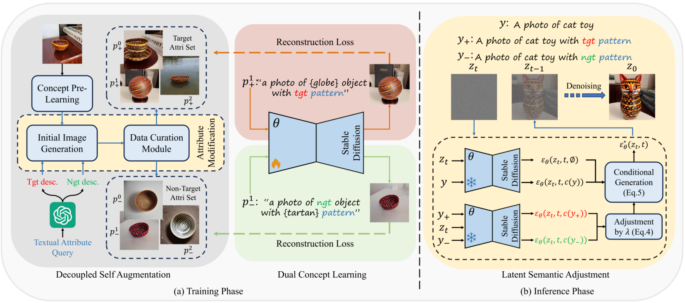

# U-VAP

Paper: "PUA^3: <u>P</u>ersonalizing <u>U</u>ser-specified <u>A</u>ppearance via Decoupled <u>A</u>ugmentation and <u>A</u>djustment" 
<!-- [[arxiv](https://arxiv.org/abs/2403.20231)]  -->

<!-- Will appear at CVPR 2024! -->

## Abstact

Recent advancements in concept personalization have enabled users to generate their custom visual content using large-scale text-to-image models. Existing works can generate the whole subject with a few reference images while struggling to precisely disentangle specific visual appearances from a subject. The main challenges lie in the significant bias of image references towards visual attributes and the lack of attribute-aware supervision or guidance.
In this paper, we design a user-specified visual appearance personalization approach named PUA^3^, allowing users to specify the desired attributes with text descriptions. We propose a novel learning strategy named decoupled self-augmentation for guiding the personalization of user-specified visual attributes. With synthetic target-related and non-target samples, the model refines its understanding of the target attributes while mitigating the impact of undesired attributes. During the inference stage, PUA^3^ conducts semantic adjustments in the latent space, where the noises predicted by a base prompt with novel concepts and learned semantics of target and non-target attributes are modified with more appropriate guidance. Extensive results demonstrate better controllability and flexibility of the proposed method over other state-of-the-art personalization methods to mimic various kinds of visual attributes in novel contexts.

## Pipeline



## Setup

Clone this project and install requirements to set up the environment (Python 3.11 is recommended):
```
conda env create -f environment.yaml
conda activate UVAP
cd U-VAP
mkdir pretrained_models
mkdir pre_outputs
mkdir outputs
```
Then download pre-trained models like [Stable Diffusion 1.5](https://huggingface.co/runwayml/stable-diffusion-v1-5) under ```U-VAP/pretrained_models/```.
The code for Textual Inversion has been updated.
The code for SDXL will be updated soon.

### Setup of GPT

In our experiments, we utilize GPT-3.5-turbo to generate augmented descriptions. You should have an OpenAI-API key for freely using GPT and write your key in the file ```U-VAP/utils/utils_gpt.py```. You can adjust the prompt for GPT in there to get better generated answers.

## Running

### Training

Put your inference images of concept in the ```U-VAP/concepts/```.

At first stage, we pre-learn the entire concept and get self augmented images by running ```attribute_augment.sh```, like:
```
bash attribute_augment.sh {device} {training step} 1  # generate descriptions
# the generated descriptions will be stored, so you can run
bash attribute_augment.sh {device} {training step} 0  # do not generate descriptions
```

For changing the initial prompt, target/non-target attributes or other parameters, you can change the content of ```attribute_augment.sh```, like:
```
...
############## self augmentation
# Generating descriptions by GPT
init_prompt="a photo of sks object in cnc color"  # initial prompt
attri_p="color"  # target attribute
attri_n="object"  # non-target attribute
CUDA_VISIBLE_DEVICES=$DEVICE python utils/run_augmentation.py \
    --model_path "${OUTPUT_DIR}" \
    --init_prompt  "${init_prompt}"\
    --attri_p "${attri_p}" \
    --attri_n "${attri_n}" \
    --n_p 50 \  # number of descriptions
    --get_description "${get_description}" \
...
```

Defaultly, filtered images are stored under the path of pre-learning model, you can futher select 2-5 images and put them into ```U-VAP/augmented_data/```.

At second stage for dual concept learning, run ```run_dual_concept_learning.sh```, like:
```
bash run_dual_concept_learning.sh 3 1000  # 1000 training steps
```

### Inference
Directly run ```bash test.sh {device} {adjustment weight} {guidance scale w_a} {guidance scale w} {seed}``` after changing the prompt in this file.

## Results


## Comparison to Earlier Publication


<!-- ## Citation

```BibTeX
@inproceedings{wu2024u,
  title={U-VAP: User-specified Visual Appearance Personalization via Decoupled Self Augmentation},
  author={Wu, You and Liu, Kean and Mi, Xiaoyue and Tang, Fan and Cao, Juan and Li, Jintao},
  booktitle={Proceedings of the IEEE/CVF Conference on Computer Vision and Pattern Recognition},
  pages={9482--9491},
  year={2024}
}
``` -->

## Acknowledgements

The training code is mainly based on [diffusers](https://github.com/huggingface/diffusers).
