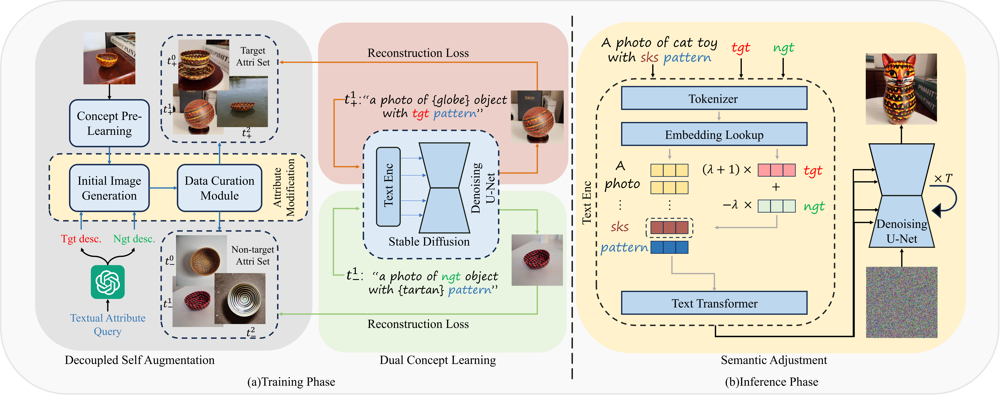

# U-VAP


Paper: "U-VAP: User-specified Visual Appearance Personalization via Decoupled Self Augmentation" [[arxiv](https://arxiv.org/abs/2403.20231)] 

Will appear at CVPR 2024!

## Abstact

Concept personalization methods enable large text-to-image models to learn specific subjects (e.g., objects/poses/3D models) and synthesize renditions in new contexts. Given that the image references are highly biased towards visual attributes, state-of-the-art personalization models tend to overfit the whole subject and cannot disentangle visual characteristics in pixel space. In this study, we proposed a more challenging setting, namely fine-grained visual appearance personalization. Different from existing methods, we allow users to provide a sentence describing the desired attributes. A novel decoupled self-augmentation strategy is proposed to generate target-related and non-target samples to learn user-specified visual attributes. These augmented data allow for refining the model's understanding of the target attribute while mitigating the impact of unrelated attributes. At the inference stage, adjustments are conducted on semantic space through the learned target and non-target embeddings to further enhance the disentanglement of target attributes. Extensive experiments on various kinds of visual attributes with SOTA personalization methods show the ability of the proposed method to mimic target visual appearance in novel contexts, thus improving the controllability and flexibility of personalization.

## Pipeline



## Setup

Clone this project and install requirements to set up the environment (Python 3.11 is recommended):
```
conda env create -f environment.yaml
conda activate UVAP
cd U-VAP
mkdir pretrained_models
mkdir pre_outputs
mkdir outputs
```
Then download pre-trained models like [Stable Diffusion 1.5](https://huggingface.co/runwayml/stable-diffusion-v1-5) under ```U-VAP/pretrained_models/```.
The code for SDXL will be updated soon.

### Setup of GPT

In our experiments, we utilize GPT-3.5-turbo to generate augmented descriptions. You should have an OpenAI-API key for freely using GPT and write your key in the file ```U-VAP/utils/utils_gpt.py```. You can adjust the prompt for GPT in there to get better generated answers.

## Running

### Training

Put your inference images of concept in the ```U-VAP/concepts/```.

At first stage, we pre-learn the entire concept and get self augmented images by running ```attribute_augment.sh```, like:
```
bash attribute_augment.sh {device} {training step} 1  # generate descriptions
# the generated descriptions will be stored, so you can run
bash attribute_augment.sh {device} {training step} 0  # do not generate descriptions
```

For changing the initial prompt, target/non-target attributes or other parameters, you can change the content of ```attribute_augment.sh```, like:
```
...
############## self augmentation
# Generating descriptions by GPT
init_prompt="a photo of sks object in cnc color"  # initial prompt
attri_p="color"  # target attribute
attri_n="object"  # non-target attribute
CUDA_VISIBLE_DEVICES=$DEVICE python utils/run_augmentation.py \
    --model_path "${OUTPUT_DIR}" \
    --init_prompt  "${init_prompt}"\
    --attri_p "${attri_p}" \
    --attri_n "${attri_n}" \
    --n_p 50 \  # number of descriptions
    --get_description "${get_description}" \
...
```

Defaultly, filtered images are stored under the path of pre-learning model, you can futher select 2-5 images and put them into ```U-VAP/augmented_data/```.

At second stage for dual concept learning, run ```run_dual_concept_learning.sh```, like:
```
bash run_dual_concept_learning.sh 3 1000  # 1000 training steps
```

### Inference
Directly run ```bash test.sh {device} {adjustment weight} {seed}``` after changing the prompt in this file.

## Results


## Citation

```BibTeX
@inproceedings{wu2024u,
  title={U-VAP: User-specified Visual Appearance Personalization via Decoupled Self Augmentation},
  author={Wu, You and Liu, Kean and Mi, Xiaoyue and Tang, Fan and Cao, Juan and Li, Jintao},
  booktitle={Proceedings of the IEEE/CVF Conference on Computer Vision and Pattern Recognition},
  pages={9482--9491},
  year={2024}
}
```

## Acknowledgements

The training code is mainly based on [diffusers](https://github.com/huggingface/diffusers).
